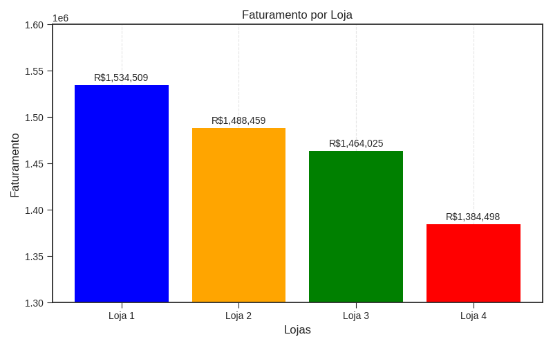
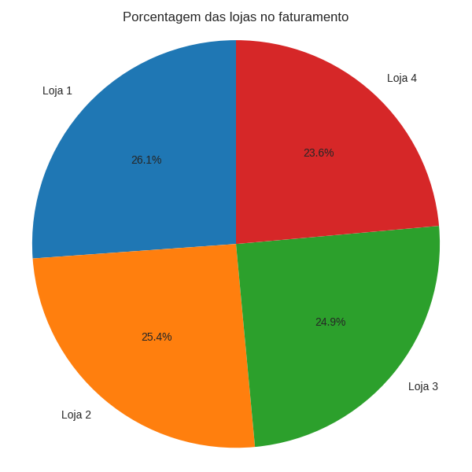
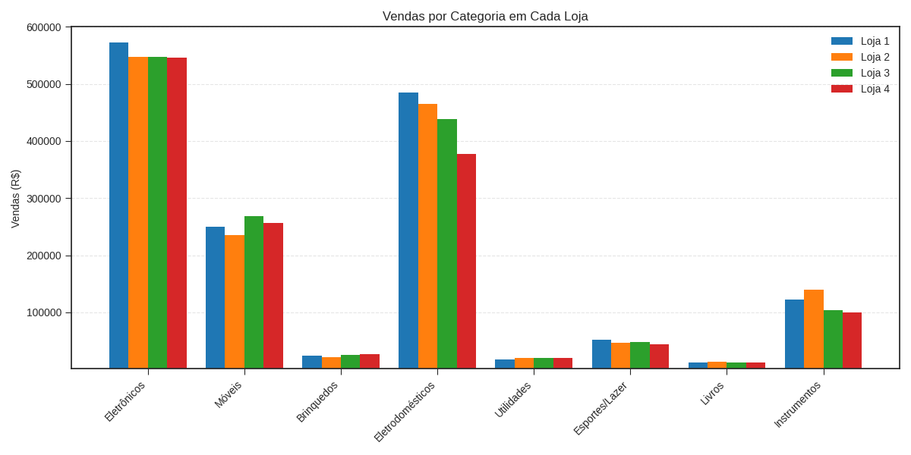
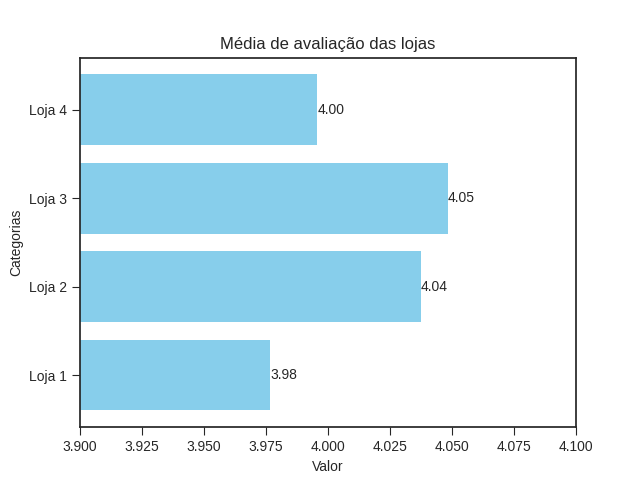

# 📊 Alura Store
## 🎯 Objetivo:
O objetivo é analisar quatro lojas do senhor João e decidir, por meio da dos gráficos e dados, a loja que o senhor João deverá vender.

## Gráficos
### 💰 Faturamento por Lojas
Nessa seção é apresenatado o valor total arrecadado em cada loja. A loja que apresenta o maior faturamento é a Loja e que tem o menor é a Loja 4

Nesse gráfico também é possível notar o quanto cada loja gera em porcentagem.

### :chart_with_upwards_trend: Venda por Categoria em cada Loja:
A análise por categoria permite identificar quais tipos de produtos são mais vendidos em cada loja, ajudando a compreender o foco e a especialização de cada uma. Nessa 

### :chart_with_downwards_trend:  Média de Avaliação das Lojas:
Nessa seção é possível identificar que na média de avaliação a loja 1 é a que tem a menor média, logo em seguida, um pouco melhor, é a loja 4. Já a loja 3 e 2 apresenta as melhores média.

## :white_check_mark: Conclusão:

Lavando em consideração a análise realizada com base nos dados das quatro lojas, conclui-se que a loja mais indicada para o senhor João vender é a loja 4. Essa loja apresenta o menor faturamento entre as quatro, além de ocupar a terceira posição na média de avaliação, com nota 4, ficando atrás apenas da loja 1, que possui média de 3,98. Além disso, a loja 4 é que menos vende eletrodómesticos, que uma categoria que mais gera dinheiro para as lojas

## 💻 Tecnologias

### Bibliotecas:
<ul>
<li>Matplotlib</li>
<li>Numpy</li>
  </ul>
  
## Autor
[  Misael Oliveira](https://github.com/Misael-Oliveira) 
